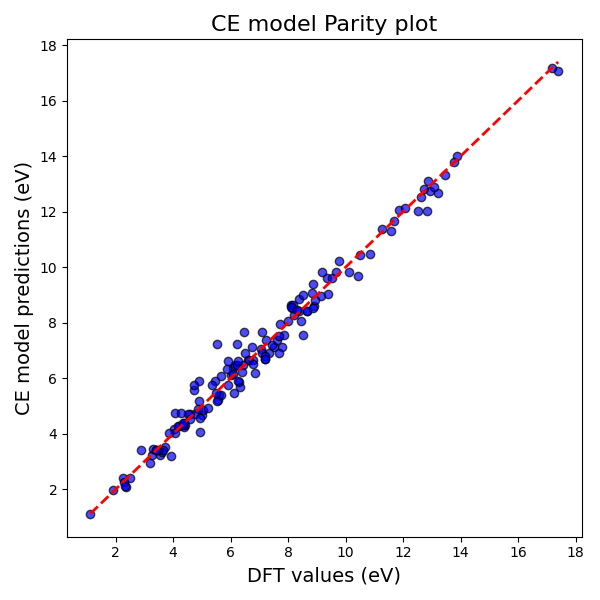

## Overview

**Zacros CE Fit** is a utility for performing **statistical analysis** on Amat_Bvec file obtained using cluster expansion fitting exercise. The following statistical information can be obtained using the utility: 

- **Correlation Analysis:** Computes Pearson, Kendall, and Spearman correlation matrices with heatmaps.  
- **Frequency Distributions:** Plots histograms of numeric data for quick exploratory analysis.  
- **CE fit parity plot:** Generates a parity plot which shows the CE preditions and DFT values. 

All outputs are organized into **separate folders** in the same directory as the input Excel file.

Kindly note that this is a beta version. The utility is undergoing further tests and the final version will be uploaded soon.

---

### The following plots are generated using the Zacros CE fit utility ###### 

### Correlation Matrix (example)


### Frequency Distribution (example)


### Frequency Distribution (example)


### Prerequisites
- Python >= 3.1
- pip
- **[Pandas](https://pandas.pydata.org/)**
- **[Scipy](https://scipy.org/)**
- **[scikit-learn](https://scikit-learn.org/stable/)**

### Installation
As shown below, use the Windows Command Prompt (cmd.exe) to clone the repository into a directory in your local machine, and install Zacros_CE_fit utility using pip.
```bash
git clone https://github.com/sharath291994/CE_fit.git
cd Zacros_CE_fit
pip install .
```

### Usage
Please follow the steps below to generate the results using the Zacros CE utility: 
1) Place your Amat_Bvec.xlsx file in a directory.
2) In the Windows Command Prompt, change the path to the location of Amat_Bvec.xlsx file. 
3) Run the following command:
```bash
python -m zacros_ce_fit.cli Amat_Bvec.xlsx --correlation --histograms --CEfit 
```

### Options
The following options are available in the utility: 
1) --correlation : Generate correlation matrices and heatmaps.
2) --histograms : Generate frequency distribution histograms.
3) --CEfit : Generates the CE fit parity plot.

### Output
Running the utility creates the following folders in the the directory where your Amat_Bvec.xlsx file is stored:
1) correlation_matrices: It contains heatmap images of correlation matrices and Excel files. 
2) frequency_distributions: It contains histogram images for each numeric column.
3) CE fit parity plot: It portrays the 

The following message will appear in the Windows Command Prompt after the folders are created: 
```bash
Analysis complete. Results saved in subfolders of: path\ZACROS_CE_File
```

### Contributing
Contributions are welcome! Please fork the repository, make your changes, and submit a pull request.

### License
This project is licensed under the MIT License.


