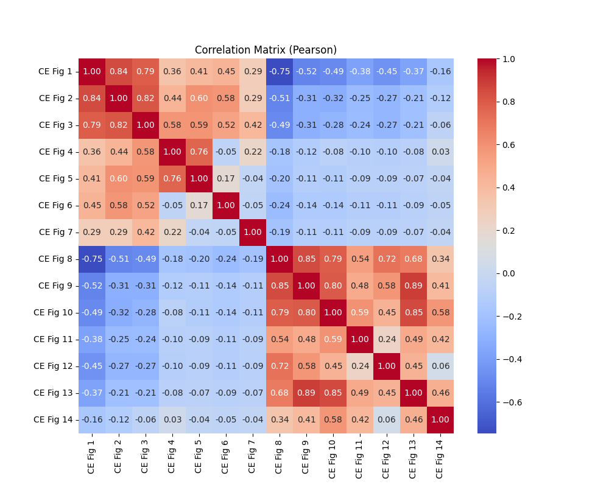

## Overview

**Zacros CE Fit** is a utility for performing **statistical analysis** on AmatBvec file obtained using cluster expansion fitting exercise. The following statistical information can be obtained using the utility: 

- **Correlation Analysis:** Computes Pearson, Kendall, and Spearman correlation matrices with heatmaps.  
- **Frequency Distributions:** Plots histograms of numeric data for quick exploratory analysis.  
- **Statistical Summary:** Generates detailed descriptive statistics including mean, median, mode, variance, skewness, and kurtosis, saved in an Excel file.  

All outputs are organized into **separate folders** in the same directory as the input Excel file.

Kindly note that this is a beta version. The utility is undergoing further tests and the final version will be uploaded soon.

---

### The following plots are generated using the Zacros CE fit utility ###### 

### Correlation Matrix (example)

### Frequency Distribution (example)

### Prerequisites
- Python >= 3.8
- pip
- **[Pandas](https://pandas.pydata.org/)**
- **[Scipy](https://scipy.org/)**

### Installation
Please follow the steps below to install the Zacros CE utility on your Windows machine:
1) Download the source code from the Zacros_CE_fit repository and store it in a folder. 
2) In the Windows Command Prompt, change the path to the location of the source code (where pyproject.toml file is available).
3) Run the following command: pip install . 

### Usage
Please follow the steps below to generate the results using the Zacros CE utility: 
1) Place your AmatBvec.xlsx file in a directory.
2) In the Windows Command Prompt, change the path to the location of Amat_Bvec.xlsx file. 
3) Run the following command: zacros_ce_fit Amat_Bvec.xlsx --correlation --histograms --stats 
4) Alternatively, you can run the following command: python -m zacros_ce_fit.cli AmatBvec.xlsx --correlation --histograms --stats 

### Options
The following options are available in the utility: 
1) --correlation : Generate correlation matrices and heatmaps.
2) --histograms : Generate frequency distribution histograms.
3) --stats : Generate statistical summary in Excel format.

### Output
Running the utility creates the following folders in the the directory where your AmatBvec.xlsx file is stored:
1) correlation_matrices: It contains heatmap images of correlation matrices and Excel files. 
2) frequency_distributions: It contains histogram images for each numeric column.
3) statistical_summary: It provides statistical information about each of the CE figure/parameter. 

### Contributing
Contributions are welcome! Please fork the repository, make your changes, and submit a pull request.

### License
This project is licensed under the MIT License.

